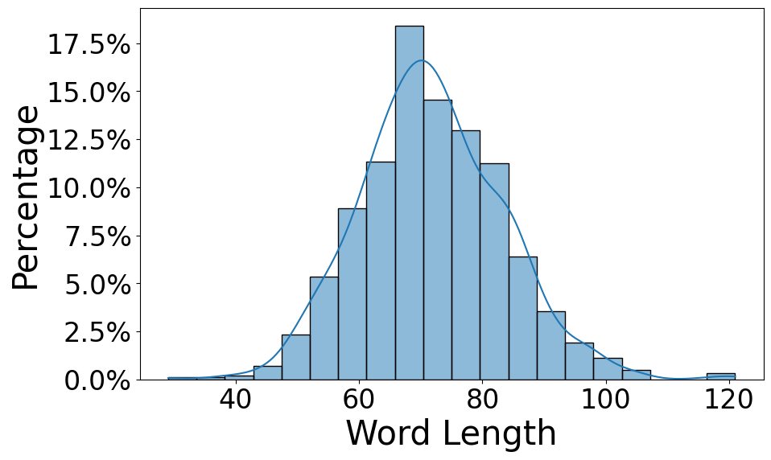
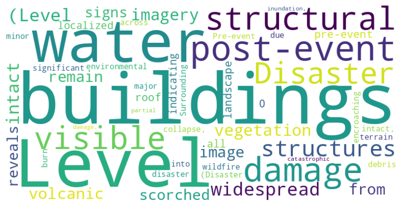

# RSCC

**RSCC: A Large-Scale Remote Sensing Change Caption Dataset for Disaster Events**

Zhenyuan Chen, Chenxi Wang, Ningyu Zhang, Feng Zhang

Zhejiang University

<a href='https://bili-sakura.github.io/RSCC/'></a>
<a href='https://huggingface.co/datasets/BiliSakura/RSCC'></a>
<a href='https://huggingface.co/BiliSakura/RSCCM'></a>

## Overview

We introduce the Remote Sensing Change Caption (RSCC) dataset, a new benchmark designed to advance the development of large vision-language models for remote sensing. Existing image-text datasets typically rely on single-snapshot imagery and lack the temporal detail crucial for Earth observation tasks. By providing 62,351 pairs of pre-event and post-event images accompanied by detailed change captions, RSCC bridges this gap and enables robust disaster-awareness bi-temporal understanding. We demonstrate its utility through comprehensive experiments using interleaved multimodal large language models. Our results highlight RSCC’s ability to facilitate detailed disaster-related analysis, paving the way for more accurate, interpretable, and scalable vision-language applications in remote sensing.

<div>

</div>

## 📢News/TODO

**[TODO]** <span style="color:red">Add the latest temporal MLLMs</span>

- [ ] [Skywork-R1V](https://huggingface.co/Skywork)
- [ ] [NVILA](https://huggingface.co/collections/Efficient-Large-Model/nvila-674f8163543890b35a91b428)
- [ ] [EarthDial](https://huggingface.co/akshaydudhane/EarthDial_4B_RGB)

**[IN PROGRESS]** <span style="color:blue">Release RSCC dataset</span>

- [x] <span style="color:gray">2025/05/01</span> All pre-event & post-event images of RSCC (total: 62,351 pairs) are released.
- [x] <span style="color:gray">2025/05/01</span> The change captions of RSCC-Subset (988 pairs) are released, including 10 baseline model results and QvQ-Max results (ground truth).
- [x] <span style="color:gray">2025/05/01</span> The change captions based on Qwen2.5-VL-72B-Instruct of RSCC (total: 62,351 pairs) are released.
- [ ] Release RSCC change captions based on strong models (e.g., QvQ-Max, o3).

**[COMPLETED]** <span style="color:green">Release code for inference</span>

- [x] <span style="color:gray">2025/05/01</span> Naive inference with baseline models.
- [x] <span style="color:gray">2025/05/15</span> Training-free method augmentation (e.g., VCD, DoLa, DeCo).

**[COMPLETED]** <span style="color:green"> <span style="color:blue">Release RSCCM training scripts</span>

**[COMPLETED]** <span style="color:green">Release code for evaluation</span>

- [x] <span style="color:gray">2025/05/01</span> Metrics for N-Gram (e.g. BLEU, METEOR, ROUGE).
- [x] <span style="color:gray">2025/05/01</span> Metrics for contextual similarity (e.g. Sentence-T5 Similarity, BERTScore).
- [x] <span style="color:gray">2025/05/01</span> Auto comparison of change captions using QvQ-Max (visual reasoning VLM) as a judge.

## Dataset

The dataset can be downloaded from [Huggingface](https://huggingface.co/datasets/BiliSakura/RSCC).

<div style="display: flex; gap: 20px;">
  
  
</div>

## Benchmark Results

| Model                                               | N-Gram                                               | N-Gram                                                | Contextual Similarity                                | Contextual Similarity                                | Avg_L                                 |
| --------------------------------------------------- | ---------------------------------------------------- | ----------------------------------------------------- | ---------------------------------------------------- | ---------------------------------------------------- | ------------------------------------- |
| (#Activate Params)                                  | ROUGE(%)↑                                            | METEOR(%)↑                                            | BERT(%)↑                                             | ST5-SCS(%)↑                                          | (#Words)                              |
| BLIP-3 (3B)                                         | 4.53                                                 | 10.85                                                 | 98.83                                                | 44.05                                                | <span style="color:red;">\*456</span> |
| &nbsp;&nbsp;+ Textual Prompt                        | 10.07 (<span style="color:green;">+5.54↑</span>)     | 20.69 (<span style="color:green;">+9.84↑</span>)      | 98.95 (<span style="color:green;">+0.12↑</span>)     | 63.67 (<span style="color:green;">+19.62↑</span>)    | <span style="color:red;">\*302</span> |
| &nbsp;&nbsp;&nbsp;&nbsp;&nbsp;&nbsp;+ Visual Prompt | 8.45 (<span style="color:red;">-1.62↓</span>)        | 19.18 (<span style="color:red;">-1.51↓</span>)        | 99.01 (<span style="color:green;">+0.06↑</span>)     | 68.34 (<span style="color:green;">+4.67↑</span>)     | <span style="color:red;">\*354</span> |
| Kimi-VL (3B)                                        | 12.47                                                | 16.95                                                 | 98.83                                                | 51.35                                                | 87                                    |
| &nbsp;&nbsp;+ Textual Prompt                        | 16.83 (<span style="color:green;">+4.36↑</span>)     | 25.47 (<span style="color:green;">+8.52↑</span>)      | 99.22 (<span style="color:green;">+0.39↑</span>)     | 70.75 (<span style="color:green;">+19.40↑</span>)    | 108                                   |
| &nbsp;&nbsp;&nbsp;&nbsp;&nbsp;&nbsp;+ Visual Prompt | 16.83 (+0.00)                                        | 25.39 (<span style="color:red;">-0.08↓</span>)        | 99.30 (<span style="color:green;">+0.08↑</span>)     | 69.97 (<span style="color:red;">-0.78↓</span>)       | 109                                   |
| Phi-4-Multimodal (4B)                               | 4.09                                                 | 1.45                                                  | 98.60                                                | 34.55                                                | 7                                     |
| &nbsp;&nbsp;+ Textual Prompt                        | 17.08 (<span style="color:green;">+13.00↑</span>)    | 19.70 (<span style="color:green;">+18.25↑</span>)     | 98.93 (<span style="color:green;">+0.33↑</span>)     | 67.62 (<span style="color:green;">+33.07↑</span>)    | 75                                    |
| &nbsp;&nbsp;&nbsp;&nbsp;&nbsp;&nbsp;+ Visual Prompt | 17.05 (<span style="color:red;">-0.03↓</span>)       | 19.09 (<span style="color:red;">-0.61↓</span>)        | 98.90 (<span style="color:red;">-0.03↓</span>)       | 66.69 (<span style="color:red;">-0.93↓</span>)       | 70                                    |
| Qwen2-VL (7B)                                       | 11.02                                                | 9.95                                                  | 99.11                                                | 45.55                                                | 42                                    |
| &nbsp;&nbsp;+ Textual Prompt                        | 19.04 (<span style="color:green;">+8.02↑</span>)     | 25.20 (<span style="color:green;">+15.25↑</span>)     | 99.01 (<span style="color:red;">-0.10↓</span>)       | 72.65 (<span style="color:green;">+27.10↑</span>)    | 84                                    |
| &nbsp;&nbsp;&nbsp;&nbsp;&nbsp;&nbsp;+ Visual Prompt | 18.43 (<span style="color:red;">-0.61↓</span>)       | 25.03 (<span style="color:red;">-0.17↓</span>)        | 99.03 (<span style="color:green;">+0.02↑</span>)     | 72.89 (<span style="color:green;">+0.24↑</span>)     | 88                                    |
| LLaVA-NeXT-Interleave (8B)                          | 12.51                                                | 13.29                                                 | 99.11                                                | 46.99                                                | 57                                    |
| &nbsp;&nbsp;+ Textual Prompt                        | 16.09 (<span style="color:green;">+3.58↑</span>)     | 20.73 (<span style="color:green;">+7.44↑</span>)      | 99.22 (<span style="color:green;">+0.11↑</span>)     | 62.60 (<span style="color:green;">+15.61↑</span>)    | 75                                    |
| &nbsp;&nbsp;&nbsp;&nbsp;&nbsp;&nbsp;+ Visual Prompt | 15.76 (<span style="color:red;">-0.33↓</span>)       | 21.17 (<span style="color:green;">+0.44↑</span>)      | 99.24 (<span style="color:green;">+0.02↑</span>)     | 65.75 (<span style="color:green;">+3.15↑</span>)     | 88                                    |
| LLaVA-OneVision (8B)                                | 8.40                                                 | 10.97                                                 | 98.64                                                | 46.15                                                | <span style="color:red;">\*221</span> |
| &nbsp;&nbsp;+ Textual Prompt                        | 11.15 (<span style="color:green;">+2.75↑</span>)     | 19.09 (<span style="color:green;">+8.12↑</span>)      | 98.85 (<span style="color:green;">+0.21↑</span>)     | 70.08 (<span style="color:green;">+23.93↑</span>)    | <span style="color:red;">\*285</span> |
| &nbsp;&nbsp;&nbsp;&nbsp;&nbsp;&nbsp;+ Visual Prompt | 10.68 (<span style="color:red;">-0.47↓</span>)       | 18.27 (<span style="color:red;">-0.82↓</span>)        | 98.79 (<span style="color:red;">-0.06↓</span>)       | 69.34 (<span style="color:red;">-0.74↓</span>)       | <span style="color:red;">\*290</span> |
| InternVL 3 (8B)                                     | 12.76                                                | 15.77                                                 | 99.31                                                | 51.84                                                | 64                                    |
| &nbsp;&nbsp;+ Textual Prompt                        | _19.81_ (<span style="color:green;">+7.05↑</span>)   | _28.51_ (<span style="color:green;">+12.74↑</span>)   | **99.55** (<span style="color:green;">+0.24↑</span>) | 78.57 (<span style="color:green;">+26.73↑</span>)    | 81                                    |
| &nbsp;&nbsp;&nbsp;&nbsp;&nbsp;&nbsp;+ Visual Prompt | 19.70 (<span style="color:red;">-0.11↓</span>)       | 28.46 (<span style="color:red;">-0.05↓</span>)        | 99.51 (<span style="color:red;">-0.04↓</span>)       | **79.18** (<span style="color:green;">+0.61↑</span>) | 84                                    |
| Pixtral (12B)                                       | 12.34                                                | 15.94                                                 | 99.34                                                | 49.36                                                | 70                                    |
| &nbsp;&nbsp;+ Textual Prompt                        | **19.87** (<span style="color:green;">+7.53↑</span>) | **29.01** (<span style="color:green;">+13.07↑</span>) | 99.51 (<span style="color:green;">+0.17↑</span>)     | _79.07_ (<span style="color:green;">+29.71↑</span>)  | 97                                    |
| &nbsp;&nbsp;&nbsp;&nbsp;&nbsp;&nbsp;+ Visual Prompt | 19.03 (<span style="color:red;">-0.84↓</span>)       | 28.44 (<span style="color:red;">-0.57↓</span>)        | _99.52_ (<span style="color:green;">+0.01↑</span>)   | 78.71 (<span style="color:red;">-0.36↓</span>)       | 102                                   |
| CCExpert (7B)                                       | 7.61                                                 | 4.32                                                  | 99.17                                                | 40.81                                                | 12                                    |
| &nbsp;&nbsp;+ Textual Prompt                        | 8.71 (<span style="color:green;">+1.10↑</span>)      | 5.35 (<span style="color:green;">+1.03↑</span>)       | 99.23 (<span style="color:green;">+0.06↑</span>)     | 47.13 (<span style="color:green;">+6.32↑</span>)     | 14                                    |
| &nbsp;&nbsp;&nbsp;&nbsp;&nbsp;&nbsp;+ Visual Prompt | 8.84 (<span style="color:green;">+0.13↑</span>)      | 5.41 (<span style="color:green;">+0.06↑</span>)       | 99.23 (+0.00)                                        | 46.58 (<span style="color:red;">-0.55↓</span>)       | 14                                    |
| TEOChat (7B)                                        | 7.86                                                 | 5.77                                                  | 98.99                                                | 52.64                                                | 15                                    |
| &nbsp;&nbsp;+ Textual Prompt                        | 11.81 (<span style="color:green;">+3.95↑</span>)     | 10.24 (<span style="color:green;">+4.47↑</span>)      | 99.12 (<span style="color:green;">+0.13↑</span>)     | 61.73 (<span style="color:green;">+9.09↑</span>)     | 22                                    |
| &nbsp;&nbsp;&nbsp;&nbsp;&nbsp;&nbsp;+ Visual Prompt | 11.55 (<span style="color:red;">-0.26↓</span>)       | 10.04 (<span style="color:red;">-0.20↓</span>)        | 99.09 (<span style="color:red;">-0.03↓</span>)       | 62.53 (<span style="color:green;">+0.80↑</span>)     | 22                                    |

## Inference

### Environment Setup

```bash
cd RSCC # path of project root
conda env create -f environment.yaml # genai: env for most baseline models
conda env create -f environment_teochat.yaml # teohat: env for TEOChat
conda env create -f environment_ccexpert.yaml # CCExpert: env for CCExpert
```

### Prepare Pre-trainined Models and Dataset

> [!NOTE]
> As transformers.model_utils `from_pretrained` function would automatically download pre-trained models from huggingface.co, there is the case that you do not have internet connection and would like to use local pre-trained model folder.

We use the same style as [huggingface.co](https://huggingface.co) as `repo_id/model_id`. The model folder should be structured as below:

<details>
<summary>Show Structure</summary>

```text
/path/to/model/folder/
├── moonshotai/
│   └── Kimi-VL-A3B-Instruct/
├── Qwen/
│   └── Qwen2-VL-7B-Instruct/
├── Salesforce/
│   └── xgen-mm-phi3-mini-instruct-interleave-r-v1.5/
├── microsoft/
│   └── Phi-4-multimodal-instruct/
├── OpenGVLab/
│   └── InternVL3-8B/
├── llava-hf/
│   ├── llava-interleave-qwen-7b-hf/
│   └── llava-onevision-qwen2-7b-ov-hf/
├── mistralai/
│   └── Pixtral-12B-2409/
├── Meize0729/
│   └── CCExpert_7b/
└── jirvin16/
    └── TEOChat/
```

> [!NOTE]
> When inferencing with BLIP-3 (xgen-mm-phi3-mini-instruct-interleave-r-v1.5) and CCExpert, you may need to pre-download `google/siglip-so400m-patch14-384` under the model folder.
>
> When inference with TEOChat, you may need to pre-download:
>
> - `LanguageBind/LanguageBind_Image`
> - (Optionally) `LanguageBind/LanguageBind_Video_merge`
>
> Then set in TEOChat's `configs.json`:
>
> ```json
> {
>   "mm_image_tower": "/path/to/model/folder/LanguageBind/LanguageBind_Image",
>   "mm_video_tower": "/path/to/model/folder/LanguageBind/LanguageBind_Video_merge"
> }
> ```

</details>

Download RSCC dataset and place them under your dataset folder:

```text
/path/to/dataset/folder
├── EBD/
│   └── {events}/
├── xbd/
│   └── images-w512-h512/
│       └── {events}/
└── xbdsubset/
    └── {events}/
```

Set global variable for `PATH_TO_MODEL_FOLDER` and `PATH_TO_DATASET_FOLDER`.

```python
# `RSCC/utils/constants.py`
PATH_TO_MODEL_FOLDER = /path/to/model/folder/ #  "/home/models"
PATH_TO_DATASET_FOLDER = /path/to/dataset/folder # "/home/datasets"
```

### Inference

<details open>
<summary>0. Inference with QvQ-Max</summary>

- Set api configs under `RSCC/.env`.

```env
# API key for DashScope (keep this secret!)
DASHSCOPE_API_KEY="sk-xxxxxxxxxx"

# Model ID should match the official code
QVQ_MODEL_NAME="qvq-max-2025-03-25"

# API base URL
API_BASE_URL="https://dashscope.aliyuncs.com/compatible-mode/v1"

# Maximum concurrent workers
MAX_WORKERS=30

# Token threshold warning level
TOKEN_THRESHOLD=10000
```

- Run the script.

```python
conda activate genai
python ./inference/xbd_subset_qvq.py
```

</details>

<details>
<summary>1. Inference with baseline models</summary>

> [!WARNING]  
> We support multi-GPUs inference while the Pixtral model and CCExpert model should only be runned on cuda:0.

```python
# inference/xbd_subset_baseline.py
...existing codes...
INFERENCE_MODEL_LIST = [
"moonshotai/Kimi-VL-A3B-Instruct",
"Qwen/Qwen2-VL-7B-Instruct",
"Salesforce/xgen-mm-phi3-mini-instruct-interleave-r-v1.5",
"microsoft/Phi-4-multimodal-instruct",
"OpenGVLab/InternVL3-8B",
"llava-hf/llava-interleave-qwen-7b-hf",
"llava-hf/llava-onevision-qwen2-7b-ov-hf",
"mistralai/Pixtral-12B-2409",
# "Meize0729/CCExpert_7b", # omit
# "jirvin16/TEOChat", # omit
]
```

```python
conda activate genai
python ./inference/xbd_subset_baseline.py
# or you can speficy the output file path, log file path and device
python ./inference/xbd_subset_baseline.py --output_file "./output/xbd_subset_baseline.jsonl" --log_file "./logs/xbd_subset_baseline.log" --device "cuda:0"
```

</details>

<details>
<summary>2. Inference with TEOChat</summary>

> [!NOTE]  
> The baseline models and specialized model (i.e. TEOChat, CCExpert) use different env. You should use the correspond env along with model_list

```python
# inference/xbd_subset_baseline.py
...existing codes...
INFERENCE_MODEL_LIST = [ "jirvin16/TEOChat"]
```

```bash
conda activate teochat
python ./inference/xbd_subset_baseline.py
# or you can speficy the output file path, log file path and device
```

</details>

<details>
<summary>3. Inference with CCExpert</summary>

> [!NOTE]  
> The baseline models and specialized model (i.e. TEOChat, CCExpert) use different env. You should use the correspond env along with model_list

```python
# inference/xbd_subset_baseline.py
...existing codes...
INFERENCE_MODEL_LIST = [ "Meize0729/CCExpert_7b"]
```

```bash
conda activate CCExpert
python ./inference/xbd_subset_baseline.py
```

</details>

### Inference with Correction Decoding

```bash
python  ./inference_with_cd/inference_baseline_cd.py
```

## Evaluation

### Prepare Pre-trained Models

```text
/path/to/model/folder
├── sentence-transformers/ # used for STS-SCS metric
│   └── sentence-t5-xxl/ # or use `sentence-t5-base` for faster evaluation
└── FacebookAI/ # used for BERTSCORE metric
    └── roberta-large/ # or use `roberta-base` for faster evaluation
```

### Run Metrics

We calcuate BLEU, ROUGE, METEOR, BERTSCORE and Sentence-T5 Embedding Similarity for change captions between ground truth and other generated by baseline models.

> [!NOTE]
> As we are using [huggingface/evaluate](https://github.com/huggingface/evaluate), you need have connection to [huggingface.co](https://huggingface.co) to get scripts and related source of metrics (e.g. BLEU, ROUGE and METEOR).

```bash
conda activate genai
python ./evaluation/metrics.py \
--ground_truth_file ./output/xbd_subset_qvq.jsonl \
--predictions_file ./output/xbd_subset_baseline.jsonl > ./logs/eval.log
```

### Fine-tuning RSCCM

```bash
cd RSCC
conda env create -f environment_qwenvl_ft.yaml
conda activate qwenvl_ft
bash train/qwen-vl-finetune/scripts/sft_for_rscc_model.sh
```

### Auto Comparison with MLLMs (e.g. Qwen QvQ-Max)

We provide scripts that employ the latest visual reasoning proprietary model (QvQ-Max) to choose the best change caption from a series of candidates.

<details>
<summary>Show Steps</summary>

1. Set api configs under `RSCC/.env`.

```env
# API key for DashScope (keep this secret!)
DASHSCOPE_API_KEY="sk-xxxxxxxxxx"

# Model ID should match the official code
QVQ_MODEL_NAME="qvq-max-2025-03-25"

# API base URL
API_BASE_URL="https://dashscope.aliyuncs.com/compatible-mode/v1"

# Maximum concurrent workers
MAX_WORKERS=30

# Token threshold warning level
TOKEN_THRESHOLD=10000
```

2. Run the script.

```bash
conda activate genai
python ./evaluation/autoeval.py
```

The token usage is auto logged and you can also check `RSCC/data/token_usage.json` to keep update with remaining token number.

</details>

## Licensing Information

The dataset is released under the [CC-BY-4.0](<[https://creativecommons.org/licenses/by-nc/4.0/deed.en](https://creativecommons.org/licenses/by/4.0/deed.en)>), which permits unrestricted use, distribution, and reproduction in any medium, provided the original work is properly cited.

## 🙏 Acknowledgement

Our RSCC dataset is built based on [xBD](https://www.xview2.org/) and [EBD](https://figshare.com/articles/figure/An_Extended_Building_Damage_EBD_dataset_constructed_from_disaster-related_bi-temporal_remote_sensing_images_/25285009) datasets.

We are thankful to [Kimi-VL](https://hf-mirror.com/moonshotai/Kimi-VL-A3B-Instruct), [BLIP-3](https://hf-mirror.com/Salesforce/xgen-mm-phi3-mini-instruct-interleave-r-v1.5), [Phi-4-Multimodal](https://hf-mirror.com/microsoft/Phi-4-multimodal-instruct), [Qwen2-VL](https://hf-mirror.com/Qwen/Qwen2-VL-7B-Instruct), [Qwen2.5-VL](https://hf-mirror.com/Qwen/Qwen2.5-VL-72B-Instruct), [LLaVA-NeXT-Interleave](https://hf-mirror.com/llava-hf/llava-interleave-qwen-7b-hf),[LLaVA-OneVision](https://hf-mirror.com/llava-hf/llava-onevision-qwen2-7b-ov-hf), [InternVL 3](https://hf-mirror.com/OpenGVLab/InternVL3-8B), [Pixtral](https://hf-mirror.com/mistralai/Pixtral-12B-2409), [TEOChat](https://github.com/ermongroup/TEOChat) and [CCExpert](https://github.com/Meize0729/CCExpert) for releasing their models and code as open-source contributions.

The metrics implements are derived from [huggingface/evaluate](https://github.com/huggingface/evaluate).

The training implements are derived from [QwenLM/Qwen2.5-VL](https://github.com/QwenLM/Qwen2.5-VL).

## 📜 Citation

```bibtex
@article{rscc_chen_2025,
  title={RSCC: A Large-Scale Remote Sensing Change Caption Dataset for Disaster Events},
  author={Zhenyuan Chen, Chenxi Wang, Ningyu Zhang, Feng Zhang},
  year={2025},
  howpublished={\url{https://github.com/Bili-Sakura/RSCC}}
}
```
