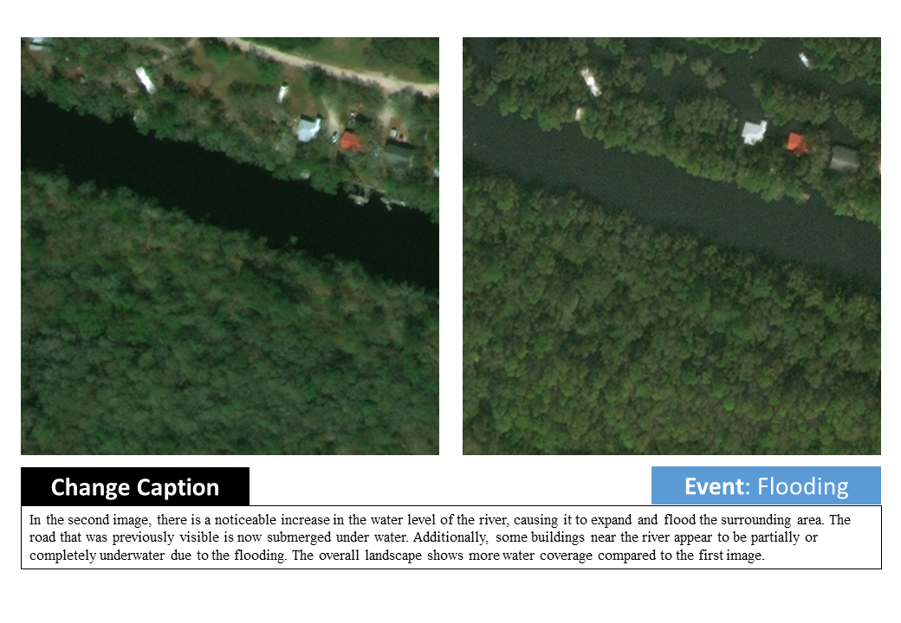

## RSCC

**RSCC: A Large-Scale Remote Sensing Change Caption Dataset for Disaster Events**

Zhenyuan Chen, Feng Zhang  
Zhejiang University

<a href='1'></a> <a href='1'></a> <a href='1'></a>


## Overview

We introduce the Remote Sensing Change Caption (RSCC) dataset, a new benchmark designed to advance the development of large vision-language models for remote sensing. Existing image-text datasets typically rely on single-snapshot imagery and lack the temporal detail crucial for Earth observation tasks. By providing 44,136 pairs of pre-event and post-event images accompanied by detailed change captions, RSCC bridges this gap and enables robust disaster-awareness bi-temporal understanding. We demonstrate its utility through comprehensive experiments using interleaved multimodal large language models. Our results highlight RSCC’s ability to facilitate detailed disaster-related analysis, paving the way for more accurate, interpretable, and scalable vision-language applications in remote sensing. 

## 📢News

- [ ] Add the latest temporal MLLMs.
- [ ] Release code for inference.
- [ ] Release code for evaluation.
- [ ] Release RSCC dataset.

## Dataset

The dataset can be downloaded from [Huggingface]().  
<div style="display: flex; gap: 20px;">
  
  
</div>

<!-- <div>

</div> -->

## Benchmark Results

| Model | N-Gram | N-Gram | Contextual Similarity | Contextual Similarity | Avg_L |
|-------|--------|----|----------------------|----|-------|
| (#Activate Params)      | ROUGE(%)↑ | METEOR(%)↑ | BERT(%)↑ | ST5-SCS(%)↑ |  (#Words)   |
| BLIP-3 (3B) | 4.53 | 10.85 | 98.83 | 44.05 | <span style="color:red;">*456</span> |
| &nbsp;&nbsp;+ Textual Prompt | 10.07 (<span style="color:green;">+5.54↑</span>) | 20.69 (<span style="color:green;">+9.84↑</span>) | 98.95 (<span style="color:green;">+0.12↑</span>) | 63.67 (<span style="color:green;">+19.62↑</span>) | <span style="color:red;">*302</span> |
| &nbsp;&nbsp;&nbsp;&nbsp;&nbsp;&nbsp;+ Visual Prompt | 8.45 (<span style="color:red;">-1.62↓</span>) | 19.18 (<span style="color:red;">-1.51↓</span>) | 99.01 (<span style="color:green;">+0.06↑</span>) | 68.34 (<span style="color:green;">+4.67↑</span>) | <span style="color:red;">*354</span> |
| Kimi-VL (3B) | 12.47 | 16.95 | 98.83 | 51.35 | 87 |
| &nbsp;&nbsp;+ Textual Prompt | 16.83 (<span style="color:green;">+4.36↑</span>) | 25.47 (<span style="color:green;">+8.52↑</span>) | 99.22 (<span style="color:green;">+0.39↑</span>) | 70.75 (<span style="color:green;">+19.40↑</span>) | 108 |
| &nbsp;&nbsp;&nbsp;&nbsp;&nbsp;&nbsp;+ Visual Prompt | 16.83 (+0.00) | 25.39 (<span style="color:red;">-0.08↓</span>) | 99.30 (<span style="color:green;">+0.08↑</span>) | 69.97 (<span style="color:red;">-0.78↓</span>) | 109 |
| Phi-4-Multimodal (4B) | 4.09 | 1.45 | 98.60 | 34.55 | 7 |
| &nbsp;&nbsp;+ Textual Prompt | 17.08 (<span style="color:green;">+13.00↑</span>) | 19.70 (<span style="color:green;">+18.25↑</span>) | 98.93 (<span style="color:green;">+0.33↑</span>) | 67.62 (<span style="color:green;">+33.07↑</span>) | 75 |
| &nbsp;&nbsp;&nbsp;&nbsp;&nbsp;&nbsp;+ Visual Prompt | 17.05 (<span style="color:red;">-0.03↓</span>) | 19.09 (<span style="color:red;">-0.61↓</span>) | 98.90 (<span style="color:red;">-0.03↓</span>) | 66.69 (<span style="color:red;">-0.93↓</span>) | 70 |
| Qwen2-VL (7B) | 11.02 | 9.95 | 99.11 | 45.55 | 42 |
| &nbsp;&nbsp;+ Textual Prompt | 19.04 (<span style="color:green;">+8.02↑</span>) | 25.20 (<span style="color:green;">+15.25↑</span>) | 99.01 (<span style="color:red;">-0.10↓</span>) | 72.65 (<span style="color:green;">+27.10↑</span>) | 84 |
| &nbsp;&nbsp;&nbsp;&nbsp;&nbsp;&nbsp;+ Visual Prompt | 18.43 (<span style="color:red;">-0.61↓</span>) | 25.03 (<span style="color:red;">-0.17↓</span>) | 99.03 (<span style="color:green;">+0.02↑</span>) | 72.89 (<span style="color:green;">+0.24↑</span>) | 88 |
| LLaVA-NeXT-Interleave (8B) | 12.51 | 13.29 | 99.11 | 46.99 | 57 |
| &nbsp;&nbsp;+ Textual Prompt | 16.09 (<span style="color:green;">+3.58↑</span>) | 20.73 (<span style="color:green;">+7.44↑</span>) | 99.22 (<span style="color:green;">+0.11↑</span>) | 62.60 (<span style="color:green;">+15.61↑</span>) | 75 |
| &nbsp;&nbsp;&nbsp;&nbsp;&nbsp;&nbsp;+ Visual Prompt | 15.76 (<span style="color:red;">-0.33↓</span>) | 21.17 (<span style="color:green;">+0.44↑</span>) | 99.24 (<span style="color:green;">+0.02↑</span>) | 65.75 (<span style="color:green;">+3.15↑</span>) | 88 |
| LLaVA-OneVision (8B) | 8.40 | 10.97 | 98.64 | 46.15 | <span style="color:red;">*221</span> |
| &nbsp;&nbsp;+ Textual Prompt | 11.15 (<span style="color:green;">+2.75↑</span>) | 19.09 (<span style="color:green;">+8.12↑</span>) | 98.85 (<span style="color:green;">+0.21↑</span>) | 70.08 (<span style="color:green;">+23.93↑</span>) | <span style="color:red;">*285</span> |
| &nbsp;&nbsp;&nbsp;&nbsp;&nbsp;&nbsp;+ Visual Prompt | 10.68 (<span style="color:red;">-0.47↓</span>) | 18.27 (<span style="color:red;">-0.82↓</span>) | 98.79 (<span style="color:red;">-0.06↓</span>) | 69.34 (<span style="color:red;">-0.74↓</span>) | <span style="color:red;">*290</span> |
| InternVL 3 (8B) | 12.76 | 15.77 | 99.31 | 51.84 | 64 |
| &nbsp;&nbsp;+ Textual Prompt | _19.81_ (<span style="color:green;">+7.05↑</span>) | _28.51_ (<span style="color:green;">+12.74↑</span>) | **99.55** (<span style="color:green;">+0.24↑</span>) | 78.57 (<span style="color:green;">+26.73↑</span>) | 81 |
| &nbsp;&nbsp;&nbsp;&nbsp;&nbsp;&nbsp;+ Visual Prompt | 19.70 (<span style="color:red;">-0.11↓</span>) | 28.46 (<span style="color:red;">-0.05↓</span>) | 99.51 (<span style="color:red;">-0.04↓</span>) | **79.18** (<span style="color:green;">+0.61↑</span>) | 84 |
| Pixtral (12B) | 12.34 | 15.94 | 99.34 | 49.36 | 70 |
| &nbsp;&nbsp;+ Textual Prompt | **19.87** (<span style="color:green;">+7.53↑</span>) | **29.01** (<span style="color:green;">+13.07↑</span>) | 99.51 (<span style="color:green;">+0.17↑</span>) | _79.07_ (<span style="color:green;">+29.71↑</span>) | 97 |
| &nbsp;&nbsp;&nbsp;&nbsp;&nbsp;&nbsp;+ Visual Prompt | 19.03 (<span style="color:red;">-0.84↓</span>) | 28.44 (<span style="color:red;">-0.57↓</span>) | _99.52_ (<span style="color:green;">+0.01↑</span>) | 78.71 (<span style="color:red;">-0.36↓</span>) | 102 |
| CCExpert (7B) | 7.61 | 4.32 | 99.17 | 40.81 | 12 |
| &nbsp;&nbsp;+ Textual Prompt | 8.71 (<span style="color:green;">+1.10↑</span>) | 5.35 (<span style="color:green;">+1.03↑</span>) | 99.23 (<span style="color:green;">+0.06↑</span>) | 47.13 (<span style="color:green;">+6.32↑</span>) | 14 |
| &nbsp;&nbsp;&nbsp;&nbsp;&nbsp;&nbsp;+ Visual Prompt | 8.84 (<span style="color:green;">+0.13↑</span>) | 5.41 (<span style="color:green;">+0.06↑</span>) | 99.23 (+0.00) | 46.58 (<span style="color:red;">-0.55↓</span>) | 14 |
| TEOChat (7B) | 7.86 | 5.77 | 98.99 | 52.64 | 15 |
| &nbsp;&nbsp;+ Textual Prompt | 11.81 (<span style="color:green;">+3.95↑</span>) | 10.24 (<span style="color:green;">+4.47↑</span>) | 99.12 (<span style="color:green;">+0.13↑</span>) | 61.73 (<span style="color:green;">+9.09↑</span>) | 22 |
| &nbsp;&nbsp;&nbsp;&nbsp;&nbsp;&nbsp;+ Visual Prompt | 11.55 (<span style="color:red;">-0.26↓</span>) | 10.04 (<span style="color:red;">-0.20↓</span>) | 99.09 (<span style="color:red;">-0.03↓</span>) | 62.53 (<span style="color:green;">+0.80↑</span>) | 22 |

## Inference

### Environment Setup

```bash
cd RSCC # path of project root
conda env create -f environment.yaml # genai: env for most baseline models
conda env create -f environment_teochat.yaml # teohat: env for TEOChat
conda env create -f environment_ccexpert.yaml # CCExpert: env for CCExpert
```

### Prepare Pre-trainined Models and Dataset


> [!NOTE]
> As transformers.model_utils `from_pretrained` function would automatically download pre-trained models from huggingface.co, there is the case that you do not have internet connection and would like to use local pre-trained model folder.

We use the same style as [huggingface.co](https://huggingface.co) as `repo_id/model_id`. The model folder should be structured as below:

```
/path/to/model/folder/ 
├── moonshotai/
│   └── Kimi-VL-A3B-Instruct/
├── Qwen/
│   └── Qwen2-VL-7B-Instruct/
├── Salesforce/
│   └── xgen-mm-phi3-mini-instruct-interleave-r-v1.5/
├── microsoft/
│   └── Phi-4-multimodal-instruct/
├── OpenGVLab/
│   └── InternVL3-8B/
├── llava-hf/
│   ├── llava-interleave-qwen-7b-hf/
│   └── llava-onevision-qwen2-7b-ov-hf/
├── mistralai/
│   └── Pixtral-12B-2409/
├── Meize0729/
│   └── CCExpert_7b/
└── jirvin16/
    └── TEOChat/
```

> When inferencing with BLIP-3(xgen-mm-phi3-mini-instruct-interleave-r-v1.5) and CCExpert, you may need pre-download google/siglip-so400m-patch14-384 under model folder. 
> When inference with TEOChat, you may need pre-download LanguageBind/LanguageBind_Image (perhaps add LanguageBind/LanguageBind_Video_merge) under model folder. Then set TEOChat `configs.json` "mm_image_tower": "/path/to/model/folder/LanguageBind/LanguageBind_Image", and  "mm_video_tower": "/path/to/model/folder/LanguageBind/LanguageBind_Video_merge".

Download RSCC dataset and place them under your dataset folder:

```
/path/to/dataset/folder
├── EBD/
│   └── {events}/
├── xbd/
│   └── images-w512-h512/
│       └── {events}/
└── xbdsubset/
    └── {events}/
```

Set global variable for `PATH_TO_MODEL_FOLDER` and `PATH_TO_DATASET_FOLDER`.

```python
# utils.constants
PATH_TO_MODEL_FOLDER = /path/to/model/folder/ #  "/home/models"
PATH_TO_DATASET_FOLDER = /path/to/dataset/folder # "/home/datasets"
```


### Inference

> [!NOTE]  
> The baseline models and specialized model (i.e. TEOChat, CCExpert) use different env. You should use the correspond env along with model_list.

> [!WARNING]  
> The Pixtral model  and CCExpert model should only be runned on cuda:0.

1. Inference with baseline models

    ```python
    # inference/xbd_subset_baseline.py
    ...existing codes...
    INFERENCE_MODEL_LIST = [
    "moonshotai/Kimi-VL-A3B-Instruct", 
    "Qwen/Qwen2-VL-7B-Instruct",
    "Salesforce/xgen-mm-phi3-mini-instruct-interleave-r-v1.5",
    "microsoft/Phi-4-multimodal-instruct",
    "OpenGVLab/InternVL3-8B",
    "llava-hf/llava-interleave-qwen-7b-hf",
    "llava-hf/llava-onevision-qwen2-7b-ov-hf",
    "mistralai/Pixtral-12B-2409",
    # "Meize0729/CCExpert_7b", # omit
    # "jirvin16/TEOChat", # omit
    ]
    ```

    ```python
    conda activate genai
    python ./inference/xbd_subset_baseline.py
    # or you can speficy the output file path, log file path and device
    python ./inference/xbd_subset_baseline.py --output_file "./output/xbd_subset_baseline.jsonl" --log_file "./logs/xbd_subset_baseline.log" --device "cuda:0"
    ```

2. Inference with TEOChat 

    ```python
    # inference/xbd_subset_baseline.py
    ...existing codes...
    INFERENCE_MODEL_LIST = [ "jirvin16/TEOChat"]
    ```

    ```bash
    conda activate teochat
    python ./inference/xbd_subset_baseline.py
    # or you can speficy the output file path, log file path and device
    ```

3. Inference with CCExpert

    ```python
    # inference/xbd_subset_baseline.py
    ...existing codes...
    INFERENCE_MODEL_LIST = [ "Meize0729/CCExpert_7b"]
    ```

    ```bash
    conda activate CCExpert
    python ./inference/xbd_subset_baseline.py
    ```

## Evaluation

### Prepare Pre-trained Models

```
/path/to/model/folder
├── sentence-transformers/ # used for STS-SCS metric
│   └── sentence-t5-xxl/ # or use `sentence-t5-base` for faster evaluation
└── FacebookAI/ # used for BERTSCORE metric
    └── roberta-large/ # or use `roberta-base` for faster evaluation
```

### Run Metrics

```bash
conda activate genai
python ./evaluation/metrics.py --ground_truth_file ./output/xbd_subset_gt_qwen25vl72b.jsonl --predictions_file ./output/xbd_subset_baseline.jsonl > ./logs/eval.log
```


## Licensing Information
The dataset is released under the [CC-BY-4.0]([https://creativecommons.org/licenses/by-nc/4.0/deed.en](https://creativecommons.org/licenses/by/4.0/deed.en)), which permits unrestricted use, distribution, and reproduction in any medium, provided the original work is properly cited.

<!-- ## 📜 Citation

```bibtex
@article{key,
  title={},
  author={},
  journal={},
  year={}
}
``` -->

## 🙏 Acknowledgement
Our VRSBench dataset is built based on [xBD](https://www.xview2.org/) and [EBD](https://figshare.com/articles/figure/An_Extended_Building_Damage_EBD_dataset_constructed_from_disaster-related_bi-temporal_remote_sensing_images_/25285009) datasets.

We are thankful to [Kimi-VL](https://hf-mirror.com/moonshotai/Kimi-VL-A3B-Instruct), [BLIP-3](https://hf-mirror.com/Salesforce/xgen-mm-phi3-mini-instruct-interleave-r-v1.5), [Phi-4-Multimodal](https://hf-mirror.com/microsoft/Phi-4-multimodal-instruct), [Qwen2-VL](https://hf-mirror.com/Qwen/Qwen2-VL-7B-Instruct), [Qwen2.5-VL](https://hf-mirror.com/Qwen/Qwen2.5-VL-72B-Instruct), [LLaVA-NeXT-Interleave](https://hf-mirror.com/llava-hf/llava-interleave-qwen-7b-hf),[LLaVA-OneVision](https://hf-mirror.com/llava-hf/llava-onevision-qwen2-7b-ov-hf), [InternVL 3](https://hf-mirror.com/OpenGVLab/InternVL3-8B), [Pixtral](https://hf-mirror.com/mistralai/Pixtral-12B-2409), [TEOChat](https://github.com/ermongroup/TEOChat) and [CCExpert](https://github.com/Meize0729/CCExpert) for releasing their models and code as open-source contributions.

The metrics implements are derived from [huggingface/evaluate](https://github.com/huggingface/evaluate).